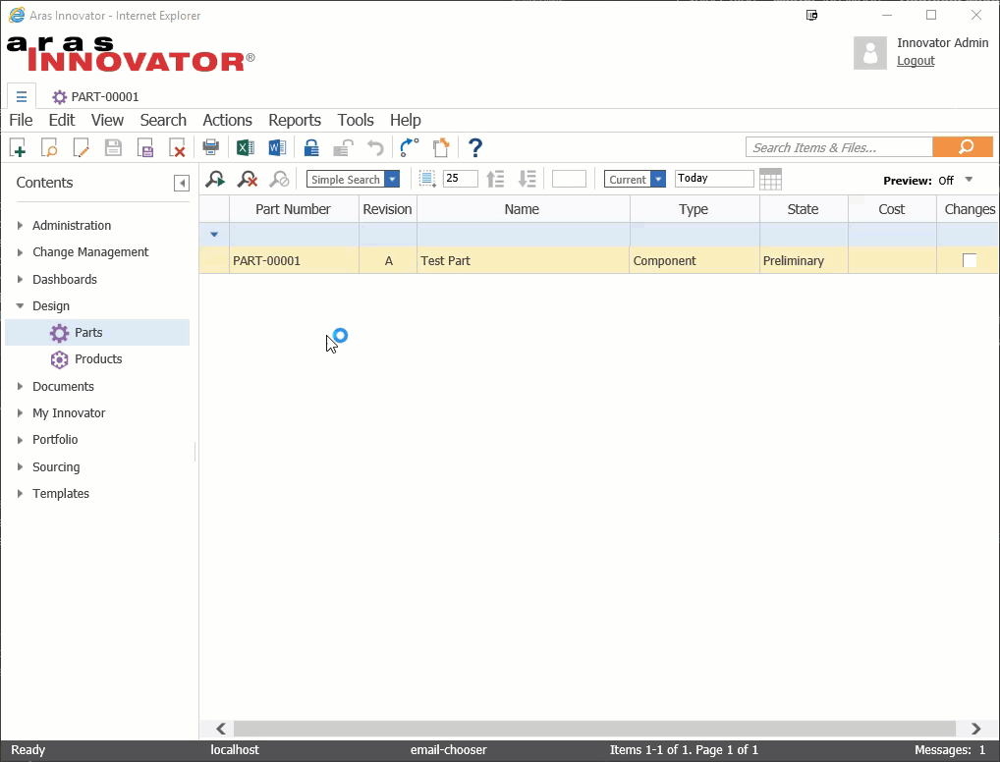

# Language Chooser for Sending Emails

The sample provided adds an action on the Part Item that will allow the user to send an email to the creator of the Part with details of the part. The action is a client action that takes user input, in the form of a "Language Chooser" so the user can determine what language to send the email in (Translated Emails must be provided by you).

## History

This project and the following release notes have been migrated from the old Aras Projects page.

Release | Notes
--------|--------
[v1](https://github.com/ArasLabs/email-language-chooser/releases/tag/v1) | LanguageChooserForEmail Sample Package
[v2](https://github.com/ArasLabs/email-language-chooser/releases/tag/v2) | Updated for Aras 11 SP9

#### Supported Aras Versions

Project | Aras
--------|------
[v1](https://github.com/ArasLabs/email-language-chooser/releases/tag/v1) | 9.3.0 SP5 - SP8
[v2](https://github.com/ArasLabs/email-language-chooser/releases/tag/v2) | 11.0 SP9

## Installation

#### Important!
**Always back up your code tree and database before applying an import package or code tree patch!**

### Prerequisites

1. Aras Innovator installed
2. Aras Package Import tool
3. **LanguageChooserForEmail** import package
4. The target Aras instance must have an SMTP server configured. See Testing Options below for testing the project without a full SMTP server configured.
5. Users must have email addresses in the target Aras database. 

### Install Steps

1. Backup your database and store the BAK file in a safe place.
2. Open up the Aras Package Import tool.
3. Enter your login credentials and click **Login**
  * _Note: You must login as root for the package import to succeed!_
4. Enter the package name in the TargetRelease field.
  * Optional: Enter a description in the Description field.
5. Enter the path to your local `..\LanguageChooserForEmail\Import\imports.mf` file in the Manifest File field.
6. Select all in the Available for Import field.
7. Select Type = **Merge** and Mode = **Thorough Mode**.
8. Click **Import** in the top left corner.
9. Close the Aras Package Import tool.

### Usage Steps



1. Login to Aras.
2. Navigate to **Design > Parts** in the TOC.
3. Right click on a Part in the grid and select **Email Details to Creator**.
4. Choose your preferred language and click **Send Email**.

## Testing Options

Don't have an SMTP server configured, or you don't want to spam your users with test emails? Here are two options for testing this project in a dev environment without a full SMTP server.

### 1. Email Debug Option

The `InnovatorServerConfig.xml` file in the root of every Aras Innovator installation contains an operating parameter for email debugging. Enabling this option will write all outgoing emails to files in `Innovator\Server\temp\` by default.

1. Open `InnovatorServerConfig.xml` for editing.
2. Replace `<disabled_operating_parameter key="email_debug_option" value="file"/>` with `<operating_parameter key="email_debug_option" value="file"/>`.
3. Follow the Usage Steps above to trigger an outgoing email.
4. Open up the new file created in `Innovator\Server\temp\`. It should look something like this:

```
TO: test@aras.fake
FROM: "Innovator Admin" <test@aras.fake>
SUBJECT: Test Part Details Japanese
<body style="font-family: Arial, Helvetica, sans-serif; font-size: small; font-weight: normal">
  <p>This is a sample email for sending Part Details in Japanese.</p>
  <p>You can use String.Format from the method code to send data into the email body.<br/>
    Part Number: PART-00001<br/>
    Classification: Component<br/>
    Part Description: Test Part</p>
</body>
```

To disable email debugging, simply revert the change to the operating parameter.

### 2. Lightweight SMTP Receiver Option

Another option for testing this project without a complete SMTP server is to use a lightweight SMTP Receiver like [Papercut](https://github.com/ChangemakerStudios/Papercut). Here's how:

1. Download and install [the latest release of Papercut](https://github.com/ChangemakerStudios/Papercut/releases).
2. Open the Papercut client and click **Options** in the toolbar.

    

3. Choose an IP address to use and leave the default port. Save your options.
4. Open `InnovatorServerConfig.xml` for editing.
5. Set the IP address you chose in the Mail tag's SMTPServer attribute: `<Mail SMTPServer="127.0.0.1"/>`.
6. Save your changes.
7. Follow the Usage Steps above to trigger an outgoing email. 

The outgoing email should appear in Papercut and look something like this:


## Contributing

1. Fork it!
2. Create your feature branch: `git checkout -b my-new-feature`
3. Commit your changes: `git commit -am 'Add some feature'`
4. Push to the branch: `git push origin my-new-feature`
5. Submit a pull request

## Credits

Created by Aras Corporation Support.

## License

Published to Github under the MIT license. See the [LICENSE file](./LICENSE.md) for license rights and limitations.
